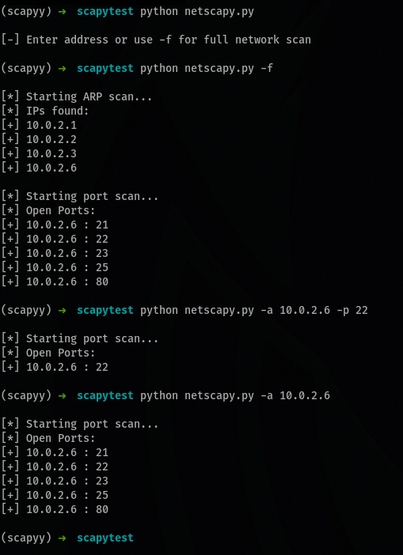
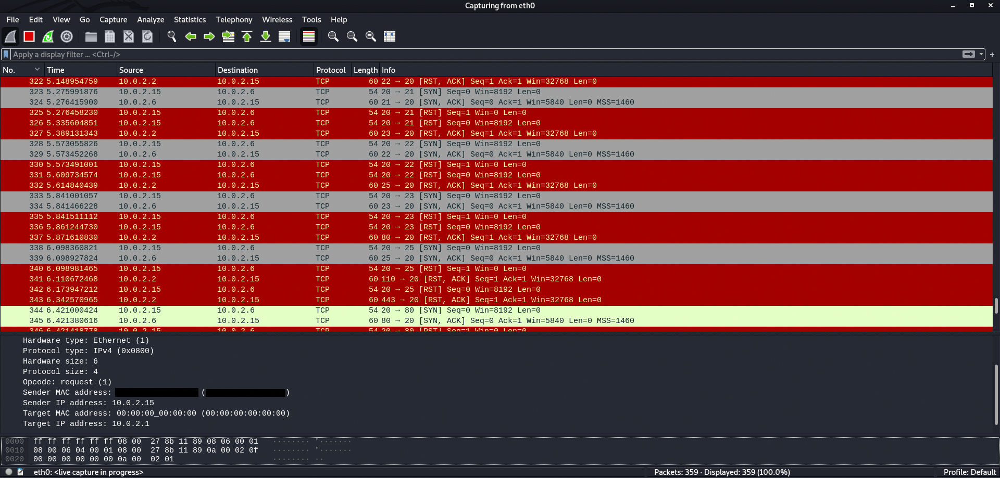

# NetScaPy

A network scanner written in python using [scapy](https://scapy.net/).

Scapy is a very powerful package that can be used to 

I'm currently working on making this untraceable to the scanner's host.

## Features

* ARP scan for /24 subnet
* All open ports in an IP
* Fake TTL (I understand there is no logical reason to add this feature, but this is a part of something bigger I'm currently working towards)

## Concept of Working

* TCP uses SYN and ACK packets to establish communication between 2 hosts (ports).
* NetScaPy sends a SYN packet and waits for a SYN-ACK response packet.
* If it receives a SYN-ACK, it means the port is open. Otherwise, it's closed.
* NetScaPy (scanner) also sends a RST packet to reset the port to avoid unnecessary slowdown on the scanee's end.
* NetScaPy also sends out ARP requests to the whole /24 subnet to obtain a list of online hosts.

## Requirements

Just Scapy

Use either `pip install scapy` or `pip install -r requirements.txt` to install scapy.

For more methods, refer to scapy's [website](https://scapy.net/).

**Note:** the above command might be pip3 if you have both versions of python or if you are not running it in a virtual environment

## Usage

```
git clone URL
cd netscapy
chmod +x netscapy.py
./netscapy.py --help # or python netscapy.py --help
```

## Working




